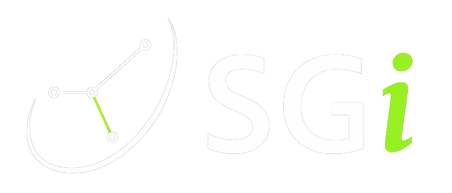

# SmartGolf Token (SGi) & DAO Governance

SmartGolf (SGi) is the utility token of the SmartGolf ecosystem — integrating real-world golf performance tracking, AI coaching, multi-sig treasury, and Snapshot DAO governance.

## ✅ Token Information

- **Name**: SmartGolf Token
- **Symbol**: SGI
- **Standard**: ERC-20
- **Network**: Ethereum Mainnet
- **Deployed Contract**: `0x0418fa3488d7e13f0c06ac5f8485d306b5748f4f`
- **MAX Total Supply**: 1,001, 322,800 SGI
- **Total Supply**: 1,000,000,000 SGI
- Burned: 1,322,800 SGi (sent to 0x0000…dead for permanent removal)
- **Final Max Supply**: 1,000,000,000 SGI
- 🧾 Full token issuance and technical changelog can be found under `/docs/`.

## 📦 Contracts

- `contracts/SGIToken.sol`: ERC-20 contract for SGI

# ✅ SmartGolf SGi Token Verification

SmartGolfToken (SGi) has been successfully verified on [Etherscan](https://etherscan.io/address/0x0418fa3488d7e13f0c06ac5f8485d306b5748f4f#code)  
- Compiler: v0.8.30+commit.73712a01  
- Optimization: Disabled  
- Verified Source Code & ABI Match  

## 🛠 Usage

This token is used in:
- Swing-to-Earn reward system
- SmartGolf Plaza competitions
- NFT-based coaching and swing history
- DAO governance and platform voting
  

### 📘 Whitepaper & 1-Page Summary
../Doc/

For pitch materials or investor inquiries, please contact: support@smartgolf.io

## DAO Governance

- **Voting Platform**: Snapshot (gasless, 1 SGi = 1 vote, minimum 100 SGi required)  
- **Treasury Management**: Gnosis Safe (3-of-5 multi-signature; board includes Founder, Advisor, Technical Lead, Community Lead, Legal)

- **ENS**: smartgolfdao.eth  

### 🌐 Community & Links

- Website: [smartgolf.io](https://smartgolf.io)
- Telegram: [t.me/SmartGolfSGi](https://t.me/SmartGolfSGi)
